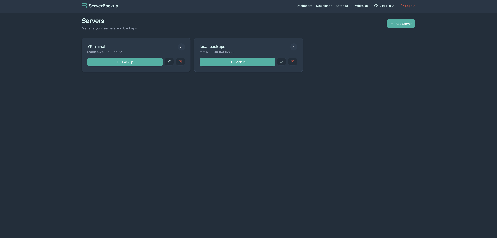
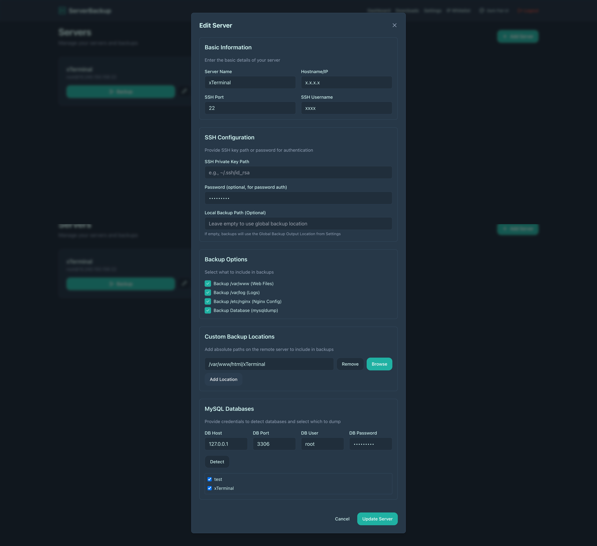
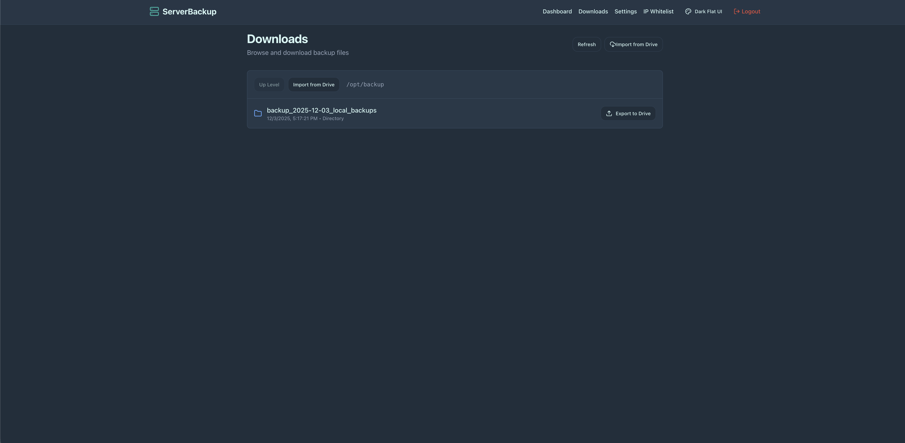
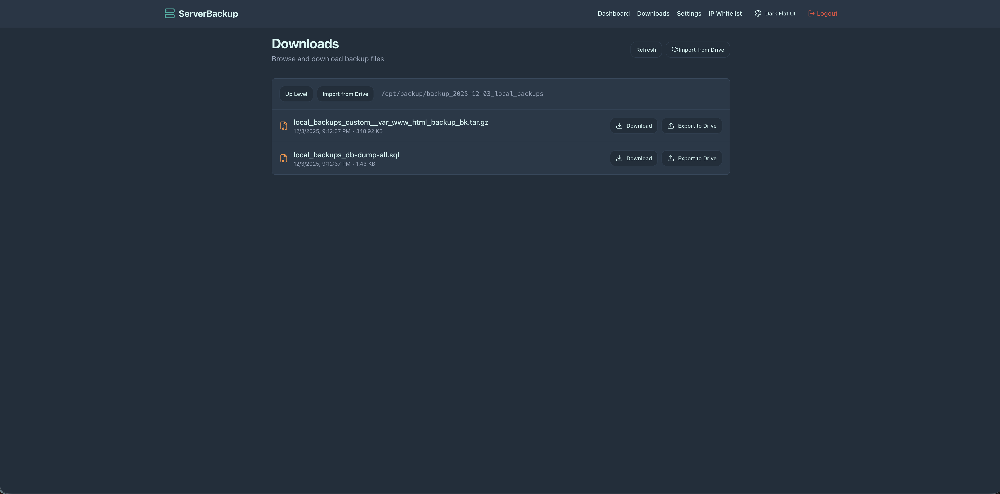
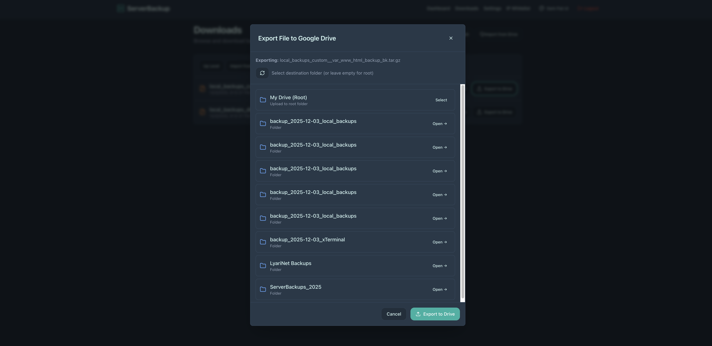
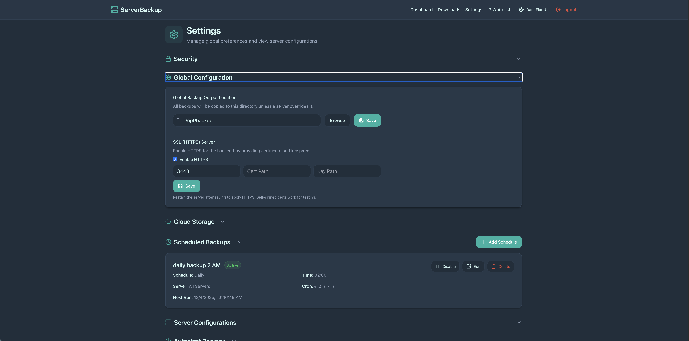
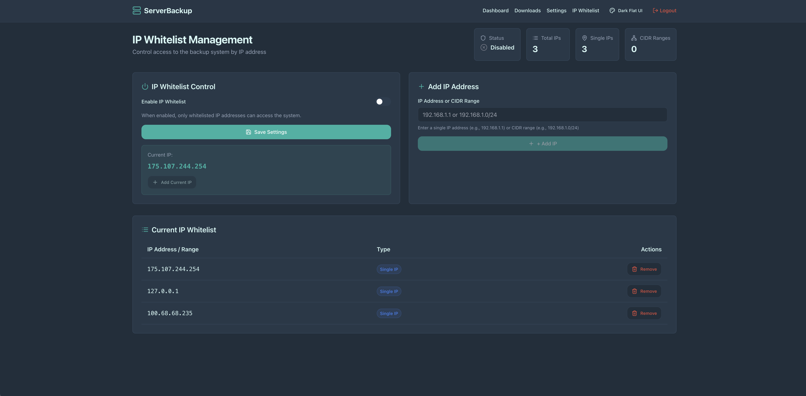
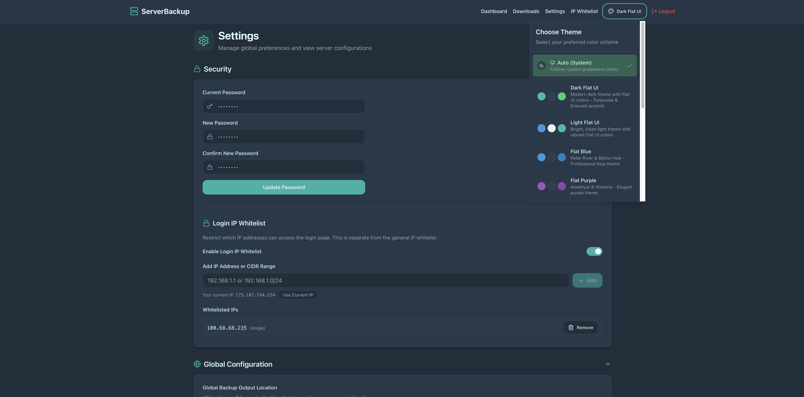

# Multi-Server Backup Manager - Files and Database MySQL for Multiple Locations and Servers

A modern web-based server backup management system for backing up files and MySQL databases across multiple servers and locations. Features automated backups, cloud storage integration (Google Drive, FTP/FTPS, S3-Compatible), and a user-friendly interface.
## Features

- 🖥️ **Multi-Server Management**: Add and manage multiple servers
- 💾 **Automated Backups**: Selectively backup paths like `/var/www/`, `/var/log/`, `/etc/nginx/`, and MySQL databases (choose what you need)
- ☁️ **Cloud Storage Integration**: Support for Google Drive, FTP/FTPS, and S3-Compatible storage providers
- 📥 **Manual Import/Export**: Import files/folders from Google Drive or export local files to Drive
- ⏰ **Scheduled Backups**: Set up cron jobs for daily, weekly, or monthly automated backups
- 🔐 **Secure Authentication**: User authentication with session management
- 🛡️ **IP Whitelisting**: Restrict access to the application and login page by IP address or CIDR ranges
- 🎨 **Smart Theme System**: Auto-detect system preference with multiple Flat UI color themes
- 🔄 **Autostart Daemon**: Automatically start the application on server boot using systemd
- 📊 **Real-time Monitoring**: View backup progress and logs in real-time
- ⚙️ **Flexible Configuration**: Custom backup paths, database selection, and more


### Server Management

*Manage multiple servers with an intuitive interface. Add, edit, or delete servers, and initiate backups with a single click.*


*Configure server details with flexible backup options. Select which paths to backup (web files, logs, nginx config, databases), add custom backup locations, and configure MySQL database selection per server.*

### Downloads & File Management

*Browse and manage backup files with a clean file browser interface. Navigate directories, download files, and export to cloud storage.*


*View detailed backup files with timestamps and sizes. Download individual files or export entire backups to Google Drive.*

### Cloud Storage Integration

*Export backup files to Google Drive with folder selection. Choose destination folders or upload to the root directory.*

### Settings & Configuration

*Comprehensive settings interface with collapsible sections. Configure global backup paths, SSL settings, cloud storage, scheduled backups, and more.*

### Security Features

*Manage IP whitelisting with detailed statistics. Enable/disable access control, add IP addresses or CIDR ranges, and view current whitelist entries.*


*IP Whitelist management with theme customization. Choose from multiple Flat UI color themes including Auto (System), Dark, Light, Blue, Purple, and more.*

## Quick Start

### Option 1: Automatic Installation (Recommended)

The easiest way to install the Server Backup Web Application is using the auto-installation script. This script will:

- **Detect your Linux distribution** (Ubuntu, Debian, Fedora, RHEL/CentOS, Arch, openSUSE)
- **Install Node.js 20.x** and all required dependencies
- **Download the application** from the repository
- **Install npm dependencies** automatically
- **Set up the database** (generate migrations and run them)
- **Build the application** for production
- **Set proper permissions** and ownership
- **Optionally configure systemd service** for autostart

#### One-line Installation

**Note**: Make sure the `auto_install.sh` file is pushed to the repository first. If you get a 404 error, use the manual installation method below.

If you have direct access to the repository, install with a single command:

```bash
curl -sSL https://raw.githubusercontent.com/lyarinet/Multi-Server-Backup-Manager/refs/heads/main/auto_install.sh | sudo bash
```

Or if you prefer wget:

```bash
wget -qO- https://raw.githubusercontent.com/lyarinet/Multi-Server-Backup-Manager/refs/heads/main/auto_install.sh | sudo bash
```

That's it! The script will automatically:
- Detect your Linux distribution
- Install all required dependencies (Node.js, npm, git, build tools, SQLite)
- Download and set up the Server Backup Web Application
- Configure the database
- Build the application
- Set up proper permissions
- Install to `/opt/server-backup` (standard location for installed software)

After installation, you can:
- Access the application at `http://your-server-ip:3000` (production) or `http://your-server-ip:5173` (development)
- Default credentials: `admin` / `admin123` (⚠️ change immediately!)

#### Manual Script Execution

If the one-line installation doesn't work (404 error), you can clone the repository and run the script:

```bash
# Clone the repository
git clone https://github.com/lyarinet/Multi-Server-Backup-Manager.git /tmp/server-backup-install
cd /tmp/server-backup-install

# Make the script executable
chmod +x auto_install.sh

# Run with sudo
sudo ./auto_install.sh
```

Or if you already have the repository cloned:

```bash
# Navigate to the project directory
cd /path/to/Multi-Server-Backup-Manager

# Make the script executable
chmod +x auto_install.sh

# Run with sudo
sudo ./auto_install.sh
```

The script will:
- Prompt you for installation directory (default: `/opt/server-backup`)
- Handle all installation steps automatically
- Provide clear instructions for next steps

### Uninstallation

To completely remove the application:

```bash
# Navigate to the installation directory
cd /opt/server-backup  # or your installation directory

# Run the uninstall script
sudo ./uninstall.sh
```

The uninstall script will:
- Stop all running processes (backend, frontend)
- Uninstall systemd service (if installed)
- Remove the installation directory
- Clean up temporary files and logs
- Optionally backup the database before deletion

**Note**: Node.js and npm are not removed as they may be used by other applications.

### Option 2: Manual Installation

If you prefer to install manually:

```bash
# Clone or navigate to the project
cd /opt/server-backup  # or your preferred directory

# Clone the repository
git clone https://github.com/lyarinet/Multi-Server-Backup-Manager.git .

# Install dependencies
npm install

# Set up database
npm run db:generate
npm run db:migrate

# Build for production
npm run build

# Start production server
npm start

# Or start development server
npm run dev
```

### Access Information

After installation, access the application:

- **Development Mode**: `http://your-server-ip:5173` (frontend) and `http://your-server-ip:3010` (backend API)
- **Production Mode**: `http://your-server-ip:3000`

### Default Credentials

- **Username**: `admin`
- **Password**: `admin123`

⚠️ **Important**: Change the default password immediately after first login!

## Cloud Storage Setup

The application supports multiple cloud storage providers for automatic backup uploads:

### Google Drive

To enable Google Drive integration, follow these guides:

📖 **[Google Drive API Setup Guide](./GOOGLE_DRIVE_SETUP.md)** - Complete setup instructions
🚀 **[Quick Start Guide](./GOOGLE_DRIVE_QUICK_START.md)** - Fast setup reference
🔑 **[Get Refresh Token](./GET_REFRESH_TOKEN.md)** - Command-line method for getting refresh token

The guides cover:
- Creating a Google Cloud Project
- Enabling Google Drive API
- Setting up OAuth credentials
- Configuring the application
- Troubleshooting common issues


**Google Drive Features:**
- **Automatic Upload**: Backups are automatically uploaded to Google Drive
- **Manual Import**: Import files or entire folders from Google Drive to your local server
- **Manual Export**: Upload local files or folders to Google Drive
- **Google Docs Support**: Automatically converts Google Docs, Sheets, and Slides to standard formats (DOCX, XLSX, PPTX)
- **Folder Navigation**: Browse and navigate through your Google Drive folders
- **Search**: Search for files in your Google Drive

### FTP/FTPS

Configure FTP or FTPS (secure FTP) for backup storage:

**Configuration Fields:**
- **Host**: FTP server hostname or IP address
- **Port**: FTP port (default: 21, FTPS typically uses 990)
- **Username**: FTP username
- **Password**: FTP password
- **Remote Path**: Directory path on the FTP server (default: /)
- **Use FTPS (SSL/TLS)**: Enable secure FTP connection
- **Passive Mode**: Recommended for most firewalls and NAT configurations

**Features:**
- Support for both FTP and FTPS (secure FTP)
- Configurable remote directory path
- Passive mode support for firewall compatibility

### S3-Compatible Storage

Support for AWS S3 and S3-compatible storage services (DigitalOcean Spaces, Wasabi, Backblaze B2, etc.):

**Configuration Fields:**
- **Endpoint URL**: S3 endpoint (e.g., `https://s3.region.amazonaws.com` for AWS)
- **Access Key ID**: S3 access key
- **Secret Access Key**: S3 secret key
- **Bucket Name**: S3 bucket name
- **Region**: AWS region (e.g., `us-east-1`) or leave empty for S3-compatible services
- **Path Prefix**: Optional prefix to organize files (e.g., `backups/`)

**Features:**
- Works with AWS S3 and S3-compatible services
- Configurable endpoint for different providers
- Optional path prefix for file organization

## What Gets Backed Up

You can selectively choose what to backup for each server:

- `/var/www/` - Web files (optional)
- `/var/log/` - Log files (optional)
- `/etc/nginx/` - Nginx configuration (optional)
- MySQL/MariaDB databases (selectable per server)
- Custom paths (configurable per server)

All backup paths are optional and can be configured individually for each server.

## Security Features


### IP Whitelisting
The application supports two levels of IP-based access control:

1. **General IP Whitelist**: Restricts access to all pages (Dashboard, Downloads, Settings, etc.) except the IP Whitelist Management page itself (to prevent lockout).

2. **Login IP Whitelist**: Restricts access to the login and registration pages only. This provides an additional layer of security by preventing unauthorized login attempts from non-whitelisted IPs.

Both whitelists support:
- Individual IP addresses (e.g., `192.168.1.100`)
- CIDR ranges (e.g., `192.168.1.0/24`)
- Enable/disable toggle
- Current IP detection

⚠️ **Important**: The IP Whitelist Management page is always accessible to prevent lockout. If you accidentally remove your IP, you can still access the management page to add it back.

### Recovery Script
If you're locked out, use the recovery script:
```bash
./fix-ip-whitelist.sh
```

This script allows you to:
- **Disable General IP Whitelist** - Removes restrictions on all pages
- **Disable Login IP Whitelist** - Removes restrictions on the login page
- **Disable Both IP Whitelists** - Disables both at once
- **Add your current IP to General Whitelist** - Adds your IP for general access
- **Add your current IP to Login Whitelist** - Adds your IP for login access
- **Show current whitelist status** - View both whitelist configurations

**Note**: The script automatically detects your current IP address and provides options to either disable the whitelists or add your IP to them.

## Development

### Quick Start Scripts

The easiest way to start the application in development mode:

```bash
# Start application in background (terminal is free immediately)
./start.sh

# View logs
tail -f logs/backend.log
tail -f logs/frontend.log

# Stop the application
./stop.sh
```

The `start.sh` script will:
- Install dependencies (if needed)
- Set up the database
- Clean up any processes using the ports
- Start backend and frontend in the background
- Save logs to `logs/backend.log` and `logs/frontend.log`
- Save process IDs to `logs/*.pid` files for easy stopping

### Manual Development Commands

Alternatively, you can run the application manually:

```bash
# Development mode (runs both frontend and backend)
npm run dev

# Build for production
npm run build

# Start production server
npm start
```

## Configuration

### Environment Variables

- `PORT` - Backend server port (default: 3000)
- `BACKEND_PORT` - Backend port for dev mode (default: 3010)
- `FRONTEND_PORT` - Frontend dev server port (default: 5173)
- `NODE_ENV` - Environment mode (development/production)

### Database

The application uses SQLite with Drizzle ORM. The database file is `sqlite.db` in the project root.

### Scheduled Backups

You can schedule automated backups using cron jobs:
- **Daily**: Run backup at a specific time every day
- **Weekly**: Run backup on specific days of the week
- **Monthly**: Run backup on specific days of the month
- **Custom**: Define custom cron expressions for advanced scheduling

Cron jobs are managed from the Settings page and can be enabled/disabled individually.

### Themes


The application includes a smart theme system:
- **Auto (System)**: Automatically detects and follows your system's dark/light preference
- **Dark Theme**: Dark mode with Flat UI colors
- **Light Theme**: Light mode with Flat UI colors
- **Additional Themes**: Flat Blue, Flat Purple, Flat Orange

Theme preference is saved and persists across sessions.

### Autostart Daemon

The application can be configured to automatically start on server boot using systemd:

- **Auto-Detection**: The installation directory is automatically detected from where the management script is located
- **Easy Management**: Install, enable, and disable autostart from the Settings page
- **Service Management**: Full systemd service integration with automatic restart on failure
- **Manual Control**: Use `./manage-autostart.sh` script for command-line management

#### Quick Setup

```bash
# Install the systemd service (requires sudo)
sudo ./manage-autostart.sh install

# Enable autostart on boot
sudo ./manage-autostart.sh enable

# Check service status
./manage-autostart.sh status
```

#### Management Script

The `manage-autostart.sh` script provides the following commands:
- `install` - Install the systemd service (requires sudo)
- `uninstall` - Remove the systemd service (requires sudo)
- `enable` - Enable autostart on boot (requires sudo)
- `disable` - Disable autostart on boot (requires sudo)
- `status` - Show service status and configuration

The script automatically detects:
- Project root directory (where `package.json` exists)
- Node.js installation path
- Current user
- Service configuration

You can also manage autostart from the Settings page in the web interface.

## Project Structure

```
├── src/
│   ├── client/          # React frontend
│   ├── server/          # Express backend
│   └── shared/          # Shared TypeScript types
├── dist/                # Compiled production builds
├── drizzle/             # Database migrations
├── logs/                # Application logs (created at runtime)
├── screenshots/         # Screenshots for documentation
├── legacy/              # Original shell scripts
├── start.sh             # Start application in background
├── stop.sh              # Stop running application
├── uninstall.sh         # Uninstall script
├── fix-ip-whitelist.sh  # IP whitelist recovery script
├── manage-autostart.sh  # Systemd service management
└── auto_install.sh      # Automatic installation script
```

## API Endpoints

### Authentication
- `POST /api/auth/login` - User login
- `POST /api/auth/register` - User registration
- `POST /api/auth/change-password` - Change user password

### Server Management
- `GET /api/servers` - List all servers
- `POST /api/servers` - Add new server
- `PUT /api/servers/:id` - Update server
- `DELETE /api/servers/:id` - Delete server
- `GET /api/servers/:id/browse` - Browse server filesystem
- `POST /api/servers/:id/dbs` - List databases on server

### Backup Operations
- `POST /api/backup/:id` - Start backup for server
- `GET /api/backup/:id/status` - Get backup status
- `GET /api/backups/list` - List all backup files
- `GET /api/backups/download` - Download backup file

### Cloud Storage (Google Drive, FTP/FTPS, S3-Compatible)
- `GET /api/drive/oauth-url` - Get OAuth URL for Google Drive
- `GET /api/drive/test` - Test Google Drive connection
- `GET /api/drive/files` - List files in Google Drive
- `GET /api/drive/folders` - List folders in Google Drive
- `POST /api/drive/import` - Import file/folder from Google Drive
- `POST /api/drive/upload` - Upload file to Google Drive
- `POST /api/drive/upload-directory` - Upload directory to Google Drive
- `GET /oauth_callback` - OAuth callback for Google Drive

**Note**: FTP/FTPS and S3-Compatible configurations are managed through the Settings API endpoint.

### Settings
- `GET /api/settings` - Get application settings
- `PUT /api/settings` - Update settings

### Scheduled Backups (Cron Jobs)
- `GET /api/cron-jobs` - List all cron jobs
- `POST /api/cron-jobs` - Create new cron job
- `PUT /api/cron-jobs/:id` - Update cron job
- `DELETE /api/cron-jobs/:id` - Delete cron job

### IP Whitelist Management
- `GET /api/ip-whitelist` - List IP whitelist entries
- `POST /api/ip-whitelist` - Add IP to whitelist
- `DELETE /api/ip-whitelist/:id` - Remove IP from whitelist
- `PUT /api/ip-whitelist/enable` - Enable/disable IP whitelist
- `GET /api/ip-whitelist/status` - Get whitelist status
- `GET /api/ip-whitelist/current-ip` - Get current client IP

### Login IP Whitelist
- `GET /api/login-ip-whitelist/check` - Check if current IP is whitelisted (public)
- `GET /api/login-ip-whitelist` - List login IP whitelist entries
- `POST /api/login-ip-whitelist` - Add IP to login whitelist
- `DELETE /api/login-ip-whitelist/:id` - Remove IP from login whitelist
- `PUT /api/login-ip-whitelist/enable` - Enable/disable login IP whitelist
- `GET /api/login-ip-whitelist/status` - Get login whitelist status
- `GET /api/login-ip-whitelist/current-ip` - Get current client IP

### Autostart Management
- `GET /api/autostart/status` - Get autostart service status
- `POST /api/autostart/install` - Install systemd service
- `POST /api/autostart/enable` - Enable autostart on boot
- `POST /api/autostart/disable` - Disable autostart on boot

## Mobile App Build (Android & iOS)

This application can be built as a native mobile app using Capacitor for both Android and iOS platforms.

### Prerequisites

**For Android:**
- Android Studio installed
- Java Development Kit (JDK) 11 or higher
- Android SDK (installed via Android Studio)

**For iOS (macOS only):**
- Xcode installed
- CocoaPods (`sudo gem install cocoapods`)
- iOS SDK (installed via Xcode)

### Building Android APK

1. **Configure Android Studio Path (macOS):**

   **Option 1: Use the setup script (Recommended):**
   ```bash
   ./setup-android-studio-macos.sh
   ```
   This script will automatically detect Android Studio and configure the path.

   **Option 2: Manual configuration:**
   
   On macOS, Android Studio is typically located at:
   ```bash
   /Applications/Android Studio.app/Contents/MacOS/studio
   ```

   Set the environment variable:
   ```bash
   export CAPACITOR_ANDROID_STUDIO_PATH="/Applications/Android Studio.app/Contents/MacOS/studio"
   ```

   Or add to your `~/.zshrc` or `~/.bash_profile`:
   ```bash
   echo 'export CAPACITOR_ANDROID_STUDIO_PATH="/Applications/Android Studio.app/Contents/MacOS/studio"' >> ~/.zshrc
   source ~/.zshrc
   ```

2. **Build and Sync:**
   ```bash
   npm run android:build
   ```

3. **Open in Android Studio:**
   ```bash
   npm run android:open
   ```

4. **Build APK in Android Studio:**
   - In Android Studio: `Build` → `Build Bundle(s) / APK(s)` → `Build APK(s)`
   - APK will be in: `android/app/build/outputs/apk/debug/app-debug.apk`

### Building iOS IPA (macOS only)

1. **Install CocoaPods (if not installed):**
   ```bash
   sudo gem install cocoapods
   ```

2. **Build and Sync:**
   ```bash
   npm run ios:build
   ```

3. **Open in Xcode:**
   ```bash
   npm run ios:open
   ```

4. **Build in Xcode:**
   - Select your device or simulator
   - Click `Product` → `Archive`
   - Follow the prompts to create an IPA

### App Icons

The application includes automatic icon generation for both Android and iOS platforms.

#### Generating App Icons

Icons are automatically generated from a single source image:

```bash
# Generate all platform icons from assets/icon.png
npm run icons:generate
```

This command will:
- Generate Android icons for all densities (mdpi, hdpi, xhdpi, xxhdpi, xxxhdpi)
- Generate iOS app icons
- Create splash screens for both platforms
- Generate round icons for Android

#### Creating Your Custom Icon

**Option 1: Auto-Generate Icon**
If you don't have an icon yet, the script will automatically generate one:

```bash
# This will create a default icon if none exists
npm run icons:generate
```

**Option 2: Use Your Own Icon**
1. Create a 1024x1024 PNG image
2. Save it as `assets/icon.png`
3. Run `npm run icons:generate`

**Option 3: Use Online Tools**
- [AppIcon.co](https://www.appicon.co/) - Upload and generate icons
- [Favicon Generator](https://www.favicon-generator.org/) - Create icons from images
- [Icon Kitchen](https://icon.kitchen/) - Design and export icons

**Icon Requirements:**
- Size: 1024x1024 pixels
- Format: PNG with transparency (recommended)
- Theme: Server/backup/cloud storage related
- Colors: Use app theme colors (#0ea5e9 for primary)

#### Icon Files Location

After generation, icons are located at:
- **Source**: `assets/icon.png` (1024x1024)
- **Android**: `android/app/src/main/res/mipmap-*/`
- **iOS**: `ios/App/App/Assets.xcassets/AppIcon.appiconset/`

#### Customizing Icons

To customize the icon:
1. Edit or replace `assets/icon.png` with your 1024x1024 image
2. Run `npm run icons:generate` to regenerate all sizes
3. Rebuild the app: `npm run android:build-apk`

**Note**: The icon generator uses `@capacitor/assets` which automatically creates all required sizes and formats for both platforms.

### API Configuration for Mobile Apps

Before using the mobile app, configure the API base URL:

1. Open the app
2. On first launch, you'll see "Configure API URL" option on the login screen
3. Enter your API base URL (e.g., `https://apibk.lyarinet.com`)
4. Save the configuration
5. Login with your credentials

Alternatively, you can configure it from Settings after login:
1. Go to Settings
2. Find "API Configuration" section
3. Enter your API base URL
4. Save the configuration

**Important:** The API base URL should:
- ✅ Include protocol: `https://` or `http://`
- ✅ Include domain: `apibk.lyarinet.com`
- ❌ No trailing slash: `https://apibk.lyarinet.com` (not `/`)
- ❌ No path: `https://apibk.lyarinet.com` (not `/api`)

### Building APK Without Android Studio GUI

If you're on a Linux server or don't have Android Studio GUI installed, you can build the APK directly using Gradle:

```bash
# Build debug APK (no signing required)
npm run android:build-apk

# Build release APK (requires signing configuration)
npm run android:build-apk-release
```

The APK will be located at:
- Debug: `android/app/build/outputs/apk/debug/app-debug.apk`
- Release: `android/app/build/outputs/apk/release/app-release.apk`

**Note:** `npm run android:open` only works on macOS/Windows/Linux desktop with Android Studio GUI installed. On servers, use the build commands above.

### Troubleshooting

**Android Studio not found (macOS):**
```bash
# Check if Android Studio is installed
ls -la "/Applications/Android Studio.app/Contents/MacOS/studio"

# If found, set the path
export CAPACITOR_ANDROID_STUDIO_PATH="/Applications/Android Studio.app/Contents/MacOS/studio"

# If not found, install Android Studio from:
# https://developer.android.com/studio
```

**Building on Linux Server (No GUI):**
```bash
# 1. Install Java JDK (required for Gradle)
sudo apt update
sudo apt install -y openjdk-17-jdk

# 2. Set JAVA_HOME (optional, script will auto-detect)
export JAVA_HOME=/usr/lib/jvm/java-17-openjdk-amd64

# 3. Install Android SDK Command-Line Tools
# Download from: https://developer.android.com/studio#command-tools
# Or install via package manager:
mkdir -p ~/Android/Sdk
cd ~/Android/Sdk
wget https://dl.google.com/android/repository/commandlinetools-linux-11076708_latest.zip
unzip commandlinetools-linux-*_latest.zip
mkdir -p cmdline-tools/latest
mv cmdline-tools/* cmdline-tools/latest/ 2>/dev/null || true
rm commandlinetools-linux-*_latest.zip

# 4. Set ANDROID_HOME
export ANDROID_HOME=$HOME/Android/Sdk
export PATH=$PATH:$ANDROID_HOME/cmdline-tools/latest/bin:$ANDROID_HOME/platform-tools

# 5. Accept licenses and install required SDK components
yes | sdkmanager --licenses
sdkmanager "platform-tools" "platforms;android-34" "build-tools;34.0.0"

# 6. Create local.properties file (or let start.sh do it)
echo "sdk.dir=$ANDROID_HOME" > android/local.properties

# 7. Build APK
npm run android:build-apk
```

**Java Not Found Error:**
```bash
# Install Java JDK
sudo apt install -y openjdk-17-jdk

# Verify installation
java -version

# Set JAVA_HOME permanently (add to ~/.bashrc or ~/.zshrc)
echo 'export JAVA_HOME=/usr/lib/jvm/java-17-openjdk-amd64' >> ~/.bashrc
source ~/.bashrc
```

**Android SDK Not Found Error:**
```bash
# Error: SDK location not found. Define a valid SDK location...

# Solution 1: Install Android SDK Command-Line Tools
mkdir -p ~/Android/Sdk
cd ~/Android/Sdk
wget https://dl.google.com/android/repository/commandlinetools-linux-11076708_latest.zip
unzip commandlinetools-linux-*_latest.zip
mkdir -p cmdline-tools/latest
mv cmdline-tools/* cmdline-tools/latest/ 2>/dev/null || true

# Set environment variables
export ANDROID_HOME=$HOME/Android/Sdk
export PATH=$PATH:$ANDROID_HOME/cmdline-tools/latest/bin:$ANDROID_HOME/platform-tools

# Accept licenses and install SDK components
yes | sdkmanager --licenses
sdkmanager "platform-tools" "platforms;android-34" "build-tools;34.0.0"

# Create local.properties
echo "sdk.dir=$ANDROID_HOME" > android/local.properties

# Solution 2: Manual configuration
# If SDK is installed elsewhere, create android/local.properties:
echo "sdk.dir=/path/to/your/android/sdk" > android/local.properties
```

**CORS Errors:**
- Ensure the backend server has CORS configured (already included in the code)
- Check that the API base URL is correct
- Verify the backend server is running

**Build Errors:**
- Make sure all dependencies are installed: `npm install`
- Clean and rebuild: `npm run build:client && npm run android:build`
- For Gradle errors, check `android/app/build.gradle` configuration
- Ensure Java JDK is installed: `java -version`

**Icon Not Showing:**
- Regenerate icons: `npm run icons:generate`
- Ensure `assets/icon.png` exists (1024x1024 PNG)
- Rebuild the app after regenerating icons: `npm run android:build-apk`
- Clear app cache and reinstall on device
- Check that icons were generated in `android/app/src/main/res/mipmap-*/`

## License

This project is licensed under the **ISC License** - a simple, permissive open source license similar to MIT.

### What ISC License Allows:
- ✅ Commercial use
- ✅ Modification
- ✅ Distribution
- ✅ Private use
- ✅ Patent use

### What ISC License Requires:
- ✅ Include license and copyright notice

### What ISC License Does NOT Allow:
- ❌ Liability or warranty

**Full License Text**: See [LICENSE](LICENSE) file in the repository root.

---

### Alternative License Options

If you prefer a different license, here are popular choices for open source projects:

- **MIT License** - Most popular, very similar to ISC
- **Apache 2.0** - Permissive with explicit patent grants
- **GPL v3** - Copyleft, requires derivative works to be open source
- **BSD 3-Clause** - Similar to MIT with additional clause

ISC is already an excellent choice for open source projects and is widely used in the Node.js ecosystem.
